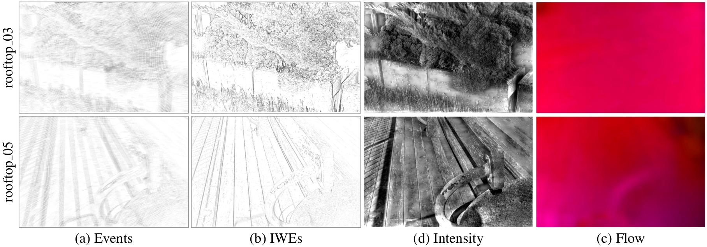

# Unsupervised Joint Learning of Optical Flow and Intensity with Event Cameras
Official repository for [**Unsupervised Joint Learning of Optical Flow and Intensity with Event Cameras**](https://arxiv.org/abs/2412.14111), by [Shuang Guo](https://shuang1997.github.io) and [Guillermo Gallego](http://www.guillermogallego.es).

## Pipeline

<!--  -->

## Results

### DSEC dataset

<!--  -->

### BS-ERGB dataset

<!--  -->

## Citation

If you use this work in your research, please cite it as follows:

```bibtex
@Article{Guo24epba,
  author        = {Shuang Guo and Guillermo Gallego},
  title         = {Unsupervised Joint Learning of Optical Flow and Intensity with Event Cameras},
  journal       = {(under review)},
  year          = 2024
}
```

# Code coming soon (upon paper acceptance)... 
<!-- ------- -->
## Setup

### High-level Input-Output

**Input**:
- Events (voxel grid).

**Output**:
- Optical flow.
- Intensity image.

## Additional Resources

* [Research page (TU Berlin RIP lab)](https://sites.google.com/view/guillermogallego/research/event-based-vision)
* [Course at TU Berlin](https://sites.google.com/view/guillermogallego/teaching/event-based-robot-vision)
* [CMax-SLAM (TRO 2024)](https://github.com/tub-rip/cmax_slam)
* [EMBA: Event-based Mosaicing Bundle Adjustment (ECCV 2024)](https://github.com/tub-rip/emba)
* [Secrets of Event-Based Optical Flow (TPAMI 2024)](https://github.com/tub-rip/event_based_optical_flow)
* [ES-PTAM: Event-based Stereo Parallel Tracking and Mapping](https://github.com/tub-rip/ES-PTAM)
* [Survey paper](http://rpg.ifi.uzh.ch/docs/EventVisionSurvey.pdf)
* [List of Resources](https://github.com/uzh-rpg/event-based_vision_resources)
