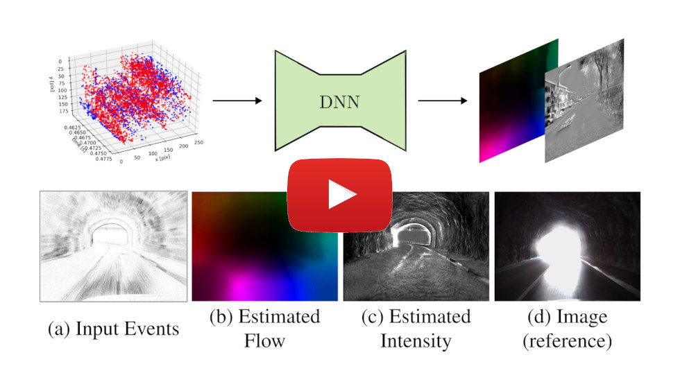

# Unsupervised Joint Learning of Optical Flow and Intensity with Event Cameras
Official repository for [**Unsupervised Joint Learning of Optical Flow and Intensity with Event Cameras**](https://arxiv.org/abs/2503.17262), **ICCV 2025 highlight**, by [Shuang Guo](https://shuang1997.github.io), [Friedhelm Hamann](https://friedhelmhamann.github.io/) and [Guillermo Gallego](http://www.guillermogallego.es).

Also known as **E2FAI**: **E**vents to **F**low **A**nd **I**ntensity

<h2 align="left">

[PDF](docs/2025_ICCV_E2FAI_compressed.pdf) | [Video](https://youtu.be/x3_nc51F4XM) 
</h2>

[](https://youtu.be/x3_nc51F4XM)

## Citation

If you use this work in your research, please cite it as follows:

```bibtex
@InProceedings{Guo25iccv,
  author        = {Shuang Guo and Friedhelm Hamann and Guillermo Gallego},
  title         = {Unsupervised Joint Learning of Optical Flow and Intensity with Event Cameras},
  booktitle     = {IEEE/CVF International Conference on Computer Vision (ICCV)},
  year          = 2025
}
```

# Code coming soon... 

<!-- ------- -->
## Setup

### High-level Input-Output

**Input**:
- Events.

**Output**:
- Optical flow.
- Intensity image.

## Related Works

* [Motion-prior Contrast Maximization (ECCV 2024)](https://github.com/tub-rip/MotionPriorCMax)
* [Secrets of Event-Based Optical Flow (TPAMI 2024)](https://github.com/tub-rip/event_based_optical_flow)
* [EVILIP: Event-based Image Reconstruction as a Linear Inverse Problem (TPAMI 2022)](https://github.com/tub-rip/event_based_image_rec_inverse_problem)
* [Event Collapse in Contrast Maximization Frameworks](https://github.com/tub-rip/event_collapse)
  
## Additional Resources

* [Research page (TU Berlin RIP lab)](https://sites.google.com/view/guillermogallego/research/event-based-vision)
* [EPBA: Event-based Photometric Bundle Adjustment](https://github.com/tub-rip/epba)
* [EMBA: Event-based Mosaicing Bundle Adjustment (ECCV 2024)](https://github.com/tub-rip/emba)
* [CMax-SLAM (TRO 2024)](https://github.com/tub-rip/cmax_slam)
* [ES-PTAM: Event-based Stereo Parallel Tracking and Mapping](https://github.com/tub-rip/ES-PTAM)
* [Course at TU Berlin](https://sites.google.com/view/guillermogallego/teaching/event-based-robot-vision)
* [Survey paper](http://rpg.ifi.uzh.ch/docs/EventVisionSurvey.pdf)
* [List of Resources](https://github.com/uzh-rpg/event-based_vision_resources)
